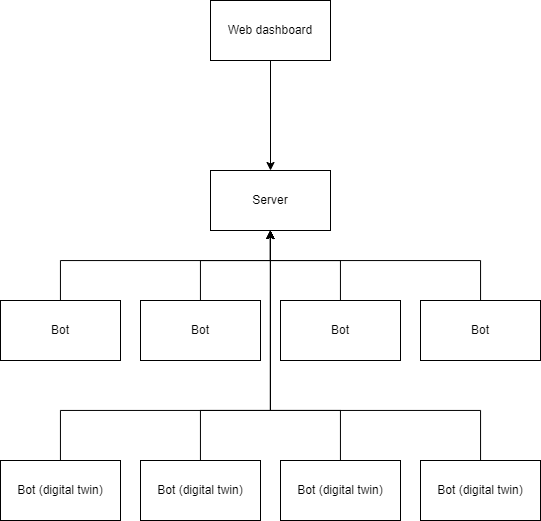
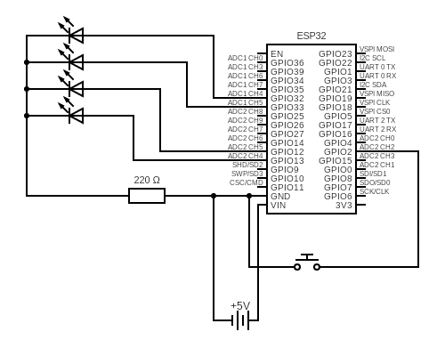

# TINCOS01
Connected Systems

Team members:
- Hidde-Jan Daniëls
- Bartholomeus Petrus
- Thijs Dregmans

Last edited on 2023-06-16

## Opdracht

De opdracht bestaat uit 3 delen:
- Server: de server is gemaakt in Python. zie `server.py`
- Fysieke bots: deze bestaat uit een ESP32 met 4 LEDs en een knop, geprogrammeerd in cpp. zie `bot/bot.ino`
- Digital twins: deze runnen in Webots. De wereld is te vinden in `webots-world/worlds/TINCOS01.wbt` De Digital Twins zijn geprogrammeerd in Python. zie `webots-world/controllers/bot-controller/bot-controller.py`
- Dashboard: deze is geprogrammeerd in [enter language dashboard]. zie `dashboard/`

## Architectuur
Hieronder ziet u een afbeelding van de architectuur.

Alles verbint met dezelfde mqtt-broker. De server leest alle berichten, en bepaalt vervolgens wat er moet gebeuren. De server geeft specifieke bots opdrachten door middel van het addresseren van die specifieke bot. Dit gebeurt middels ons opgestelde protocol. zie `protocol.md`

### Server

De server gebruikt MQTT om te communiceren met de clients.

### Client

Er zijn 2 soorten clients:

#### Bot

Een bot is een fysieke ESP32 met cpp code. Het communiceert middels MQTT met de server.
Het heeft 4 LED's om de richtingen aan te geven en een stopknop, om alles te laten stoppen.

De fysieke hardware moet als volgt worden aangesloten:

#### Digital Twin

Een digital twin van de Bot, gemaakt in WeBots. Hiervoor moet een proto worden ingeleverd. De virtuele bot communiceert met MQTT met de server. De code hiervoor is geschreven in python.

## Beoordeling 
Voor elk van de volgende criteria waaraan volledig is voldaan kan er 1 punt worden verdiend voor het eindcijfer. Alle punten bij elkaar opgeteld vormen het eindcijfer voor het vak Connected Systems.
1. [x] De unit beweegt zich in de gegeven gesimuleerde ruimte.
2. [ ] De unit ontwijkt andere aanwezige units en obstakels.
3. [x] De unit wisselt eigen positiegegevens en posities van obstakels uit met de centrale server.
4. [x] De unit bereikt het opgegeven doel.
5. [x] Een display op de unit geeft de gewenste richting aan voor iedere stap.
6. [x] De gewenste richting wordt ook aangeduid op fysieke hardware, en daar is ook een werkende noodstop-knop aanwezig.
7. [x] De routes van de units worden bepaald door middel van een algoritme.
8. [ ] Op het dashboard kunnen taken voor de units ingegeven worden en kan een noodstop gegeven worden.
9. [ ] Informatie over de positie, de uitgevoerde en de nog openstaande taken van de units wordt afgebeeld op een dashboard.
10. [ ] De units verdelen onderling taken afgestemd op de specifieke beperkingen van iedere unit.

Een extra punt kan worden toegekend als de units of het dashboard een extra feature hebben (voorafgaand
aan de toetsing afgestemd met de docent), maar alleen als er aan minstens 6 van bovenstaande criteria
voldaan is.

# todo
- check afstands sensor
- ontwijk obstakels